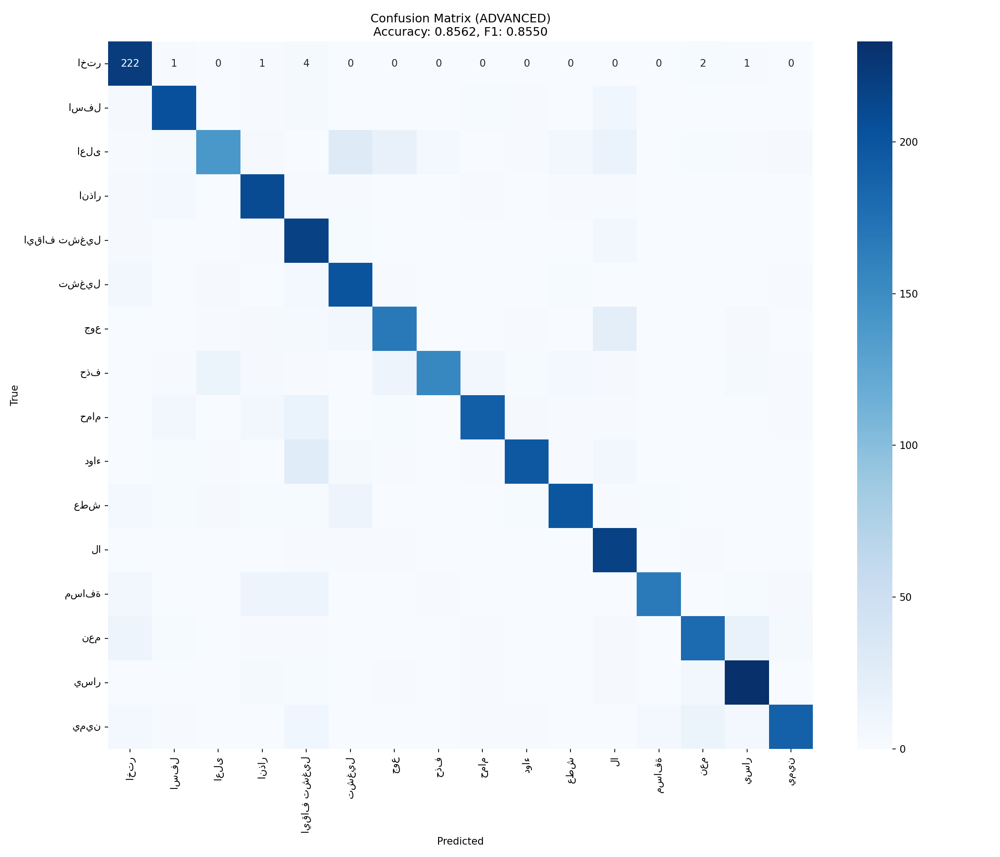

# Arabic EEG Imagined Speech Classification

End-to-end deep learning pipeline for Arabic imagined speech decoding from EEG signals.

[](https://www.python.org/downloads/)
[](https://tensorflow.org/)
[](LICENSE)
[](https://github.com/HATIMABDESSAMAD/EEG-Arabic-Imagined-Speech-CNN-Transformer/actions/workflows/ci.yml)

---

## Table of Contents

- [Project Overview](#project-overview)
- [Dataset](#dataset)
- [Architecture](#architecture)
- [Installation](#installation)
- [Quick Start](#quick-start)
- [Results](#results)
- [Project Structure](#project-structure)
- [EDA Scripts](#eda-scripts)
- [Contributing](#contributing)

---

## Project Overview

This project implements a **CNN + Transformer** hybrid architecture for classifying **16 Arabic words** from EEG brain signals. The system decodes imagined speech from non-invasive EEG recordings, enabling potential applications in:

- **Assistive technology** for paralyzed patients
- **Silent speech interfaces**
- **Brain-computer interfaces (BCI)**

### Key Features

- Multi-band frequency filtering (Theta, Alpha, Beta)
- Channel attention mechanism (Squeeze-and-Excitation)
- Transformer encoder for temporal modeling
- Advanced data augmentation for EEG
- Complete preprocessing pipeline
- Pre-trained model included

---

## Dataset

**ArEEG_Words** - Arabic Imagined Speech EEG Dataset

| Property | Value |
|----------|-------|
| **Classes** | 16 Arabic words |
| **Recordings** | 359 CSV files |
| **Participants** | 24 subjects |
| **EEG Channels** | 14 (Emotiv EPOC X) |
| **Sampling Rate** | 128 Hz |
| **Duration** | ~11 seconds per recording |

### Word Classes

| Arabic | English | Arabic | English |
|--------|---------|--------|---------|
| اختر | Select | حمام | Bathroom |
| اسفل | Down | دواء | Medicine |
| اعلى | Up | عطش | Thirst |
| انذار | Alarm | لا | No |
| ايقاف تشغيل | Stop | مسافة | Space |
| تشغيل | Start | نعم | Yes |
| جوع | Hunger | يسار | Left |
| حذف | Delete | يمين | Right |

### EEG Channels

```
AF3, F7, F3, FC5, T7, P7, O1, O2, P8, T8, FC6, F4, F8, AF4
```

---

## Architecture

### Deep Learning Pipeline (CNN + Transformer)

```
Raw EEG (14 channels × 128 Hz)
         ↓
┌────────────────────────────────┐
│  Multi-Band Butterworth Filter │
│  • Theta (4-8 Hz)              │
│  • Alpha (8-13 Hz)             │
│  • Beta (13-30 Hz)             │
└────────────────────────────────┘
         ↓
    14 × 3 = 42 channels
         ↓
┌────────────────────────────────┐
│    Segmentation (1s epochs)    │
│    Overlap: 85%                │
└────────────────────────────────┘
         ↓
┌────────────────────────────────┐
│   Z-score Normalization        │
│   (per channel, no leakage)    │
└────────────────────────────────┘
         ↓
┌────────────────────────────────┐
│   CNN Feature Extraction       │
│   • Conv1D + BatchNorm + GELU  │
│   • Channel Attention (SE)     │
│   • Residual connections       │
└────────────────────────────────┘
         ↓
┌────────────────────────────────┐
│   Transformer Encoder          │
│   • 2 layers, 4 heads          │
│   • Positional encoding        │
│   • Multi-head attention       │
└────────────────────────────────┘
         ↓
┌────────────────────────────────┐
│   Classification Head          │
│   • Global Average Pooling     │
│   • Dense + Dropout            │
│   • Softmax (16 classes)       │
└────────────────────────────────┘
```

### Model Specifications

| Component | Details |
|-----------|---------|
| Input Shape | (128, 42) |
| CNN Filters | 72 |
| Transformer Heads | 4 |
| Transformer Layers | 2 |
| Total Parameters | ~120K |
| Regularization | Dropout (0.25), L2, Label Smoothing |

---

## Installation

### Prerequisites

- Python 3.8+
- NVIDIA GPU (recommended) with CUDA support
- 8GB+ RAM

### Setup

```bash
# Clone the repository
git clone https://github.com/HATIMABDESSAMAD/EEG-Arabic-Imagined-Speech-CNN-Transformer.git
cd EEG-Arabic-Imagined-Speech-CNN-Transformer

# Create virtual environment
python -m venv venv

# Activate (Windows)
venv\Scripts\activate

# Activate (Linux/Mac)
source venv/bin/activate

# Install dependencies
pip install -r requirements.txt
```

### Verify Installation

```bash
python test_installation.py
```

---

## Quick Start

### 1. Training

**Full training (recommended):**

```bash
python train_advanced_model.py --data_root ./data --output_dir ./outputs --epochs 200 --overlap 0.85
```

**Quick test (dry run):**

```bash
python train_advanced_model.py --dry_run --epochs 10
```

**Available arguments:**

| Argument | Default | Description |
|----------|---------|-------------|
| `--data_root` | `./data` | Path to dataset |
| `--output_dir` | `./outputs_advanced` | Output directory |
| `--epochs` | 200 | Training epochs |
| `--batch_size` | 32 | Batch size |
| `--overlap` | 0.85 | Epoch overlap (0-1) |
| `--seed` | 42 | Random seed |
| `--dry_run` | False | Test with 1 file/class |

### 2. Prediction

**Single file:**

```bash
python predict.py --model_dir ./outputs_advanced --file ./new_recording.csv
```

**Directory:**

```bash
python predict.py --model_dir ./outputs_advanced --directory ./test_data --output predictions.csv
```

### 3. Visualization

```bash
python visualize_results.py --output_dir ./outputs_advanced
```

---

## Results

### Performance Metrics

| Metric | Value |
|--------|-------|
| **Test Accuracy** | **85.6%** |
| **F1-Score (macro)** | **85.5%** |
| **Baseline (random)** | 6.25% |
| **Improvement** | **13.7× better than random** |

### Per-Class Performance

| Best Classes | F1-Score | Challenging Classes | F1-Score |
|--------------|----------|---------------------|----------|
| اسفل (Down) | 93.4% | اعلى (Up) | 84.2% |
| انذار (Alarm) | 90.9% | يسار (Left) | 82.1% |
| اختر (Select) | 90.7% | ايقاف تشغيل (Stop) | 80.5% |

### Confusion Matrix



---

## Project Structure

```
arabic-eeg-speech/
|
|-- README.md                    # Documentation
|-- LICENSE                      # MIT License
|-- CONTRIBUTING.md              # Contribution guidelines
|-- requirements.txt             # Python dependencies
|-- .gitignore                   # Git ignore rules
|
|-- train_advanced_model.py      # Main training script
|-- predict.py                   # Inference script
|-- visualize_results.py         # Plot results
|-- test_installation.py         # Verify setup
|
|-- .github/workflows/           # CI/CD pipelines
|   +-- ci.yml                   # GitHub Actions workflow
|
|-- outputs_advanced/            # Trained model & results
|   |-- best_model.keras         # Trained model weights
|   |-- normalization_stats.npz  # Preprocessing stats
|   |-- test_metrics.json        # Performance metrics
|   |-- training_history.json    # Training curves data
|   +-- confusion_matrix.png     # Confusion matrix plot
|
|-- eda/                         # EDA & Traditional ML pipeline
|   |-- main.py                  # Traditional ML pipeline
|   |-- eda_areeg_words.py       # Exploratory data analysis
|   |-- csp_ovr.py               # Common Spatial Patterns
|   |-- nca_selection.py         # Feature selection (NCA)
|   |-- stacking_model.py        # Ensemble classifier
|   +-- config.py                # Configuration
|
+-- data/                        # Dataset (16 classes)
    |-- select/                  # Select
    |-- down/                    # Down
    |-- up/                      # Up
    |-- ...                      # (13 more classes)
    +-- eda_*.png/csv            # EDA visualizations
```

---

## EDA Scripts

The `eda/` folder contains **exploratory data analysis** and an alternative **traditional machine learning** pipeline:

### Scripts

| Script | Description |
|--------|-------------|
| `eda_areeg_words.py` | Exploratory data analysis & visualizations |
| `main.py` | Full ML pipeline (CSP + Stacking ensemble) |
| `csp_ovr.py` | Common Spatial Patterns (One-vs-Rest) |
| `nca_selection.py` | Neighborhood Component Analysis |
| `stacking_model.py` | Ensemble classifier (LDA, SVM, RF, KNN) |
| `preprocess.py` | Signal preprocessing utilities |

### Run EDA Pipeline

```bash
cd eda
python eda_areeg_words.py --data_dir "../data"
```

### Run Traditional ML Pipeline

```bash
cd eda
python main.py --data_dir "../data" --output_dir "./output" --n_splits 5
```

### EDA Results (in `data/` folder)

| File | Description |
|------|-------------|
| `eda_distribution_fichiers.png` | File distribution per class |
| `eda_analyse_signaux_eeg.png` | EEG signal analysis |
| `eda_analyse_par_mot.png` | Per-word analysis |
| `eda_qualite_signal.png` | Signal quality metrics |
| `eda_statistiques_eeg.csv` | EEG statistics |
| `eda_features_par_mot.csv` | Features per word class |

---

## Technical Details

### Preprocessing

1. **Multi-band filtering**: Butterworth bandpass (order=4)
   - Theta (4-8 Hz): Memory and learning
   - Alpha (8-13 Hz): Relaxation and attention
   - Beta (13-30 Hz): Cognitive activity

2. **Segmentation**: 1-second windows with 85% overlap

3. **Normalization**: Z-score per channel (fitted on training set only)

### Data Augmentation

- Gaussian noise injection (σ=0.02)
- Temporal shifting (±8 samples)
- Channel dropout (10%)
- Amplitude scaling (±10%)

### Training Strategy

- **Optimizer**: AdamW with cosine annealing
- **Loss**: Categorical cross-entropy with label smoothing (0.1)
- **Early stopping**: patience=20 epochs
- **Learning rate**: 1e-3 → 1e-5

---

## References

- ArEEG Dataset: Arabic Imagined Speech EEG
- EPOC X: Emotiv 14-channel EEG headset
- Architecture inspired by EEGNet and Conformer

---

## License

This project is licensed under the MIT License - see the [LICENSE](LICENSE) file for details.

---

## Contributing

Contributions are welcome! Please read [CONTRIBUTING.md](CONTRIBUTING.md) for details on our code of conduct and the process for submitting pull requests.

1. Fork the repository
2. Create your feature branch (`git checkout -b feature/AmazingFeature`)
3. Commit your changes (`git commit -m 'Add some AmazingFeature'`)
4. Push to the branch (`git push origin feature/AmazingFeature`)
5. Open a Pull Request

---

## Acknowledgments

- ArEEG Dataset: Arabic Imagined Speech EEG
- Emotiv EPOC X: 14-channel EEG headset
- Architecture inspired by EEGNet and Conformer

---

**If you find this project useful, please consider giving it a star!**
